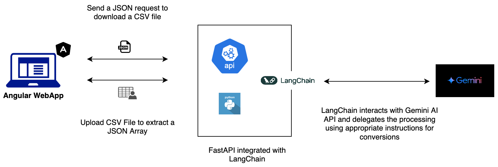

# C2J Transformer
### CSV to JSON inter-transformer built in Angular & FastAPI, leveraging Gemini AI API via LangChain.

A simple application that transforms a CSV file to JSON, and a JSON array request to a CSV file. While FastAPI exposes REST API to accept requests of these payloads and return the transformed counter representation, the entire operation that runs the transformation is delegated to Google's Gemini AI - Flash 2.0. LangChain (v0.3) equipped with Gemini's SDK serves as the adapter to the LLM, handling the integration with Gemini. 

#### The Architecture
</img>
